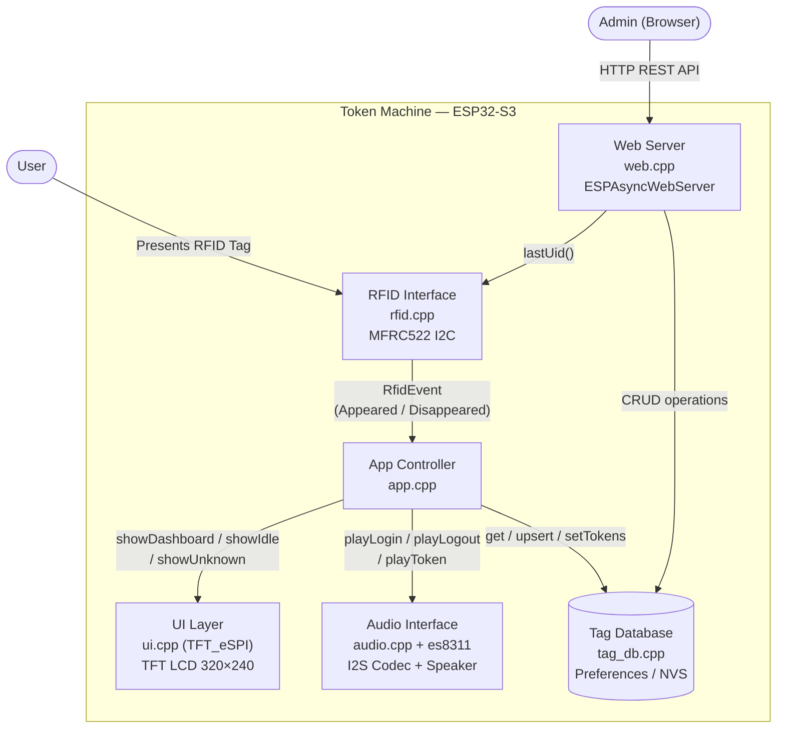
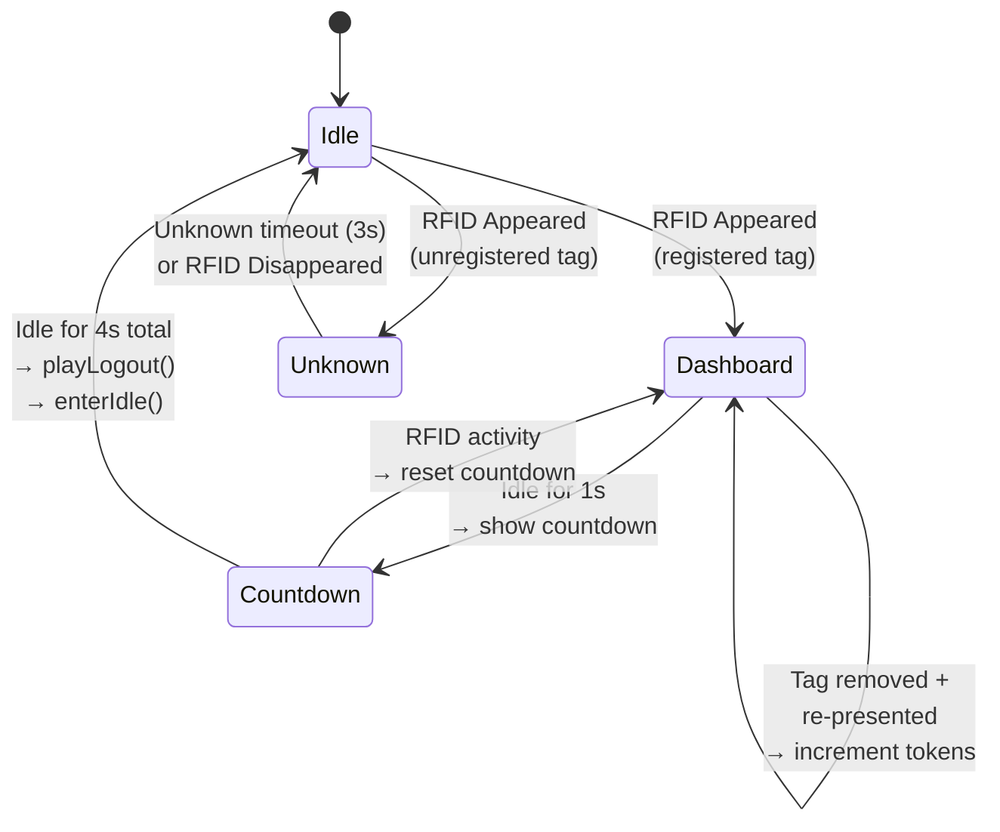
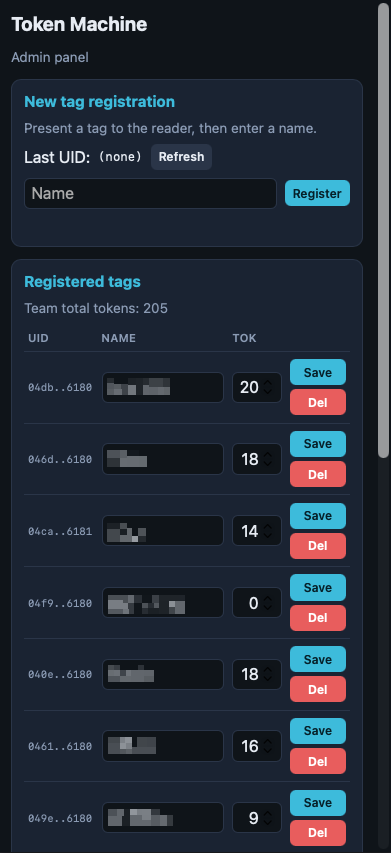
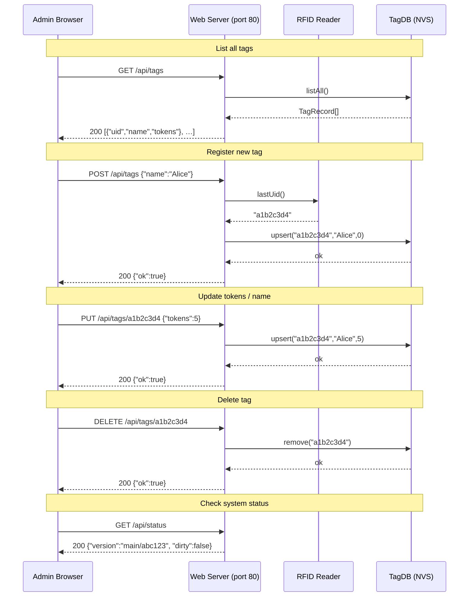

## Token Machine
An ESP32-S3 based token counter based on RFID tags.


**Use case**: Broomfield STEM chapter of FIRST Lego League encourages participants to recognize behavior of other students demonstrates the FIRST core values. At the end of sessions, they record their recognize points (a.k.a: "High Fives") in this system which tracks the through the year. When they meet milestones, (e.g. 10, 30, 100), they can redeem them for small prizes.

Features:
- 13.56 MHz RFID (MFRC522 reader)
- Color TFT LCD interface (320 x 240)
- Sound effects
- Web admin panel

Built with PlatformIO.

`AI Transparency` - LLM Agents were used to assist in the development of this project.

## Overview
### Main Interface
- The user presents their personal RFID tag to the system. The screen changes from Idle state: "Tap card to login" to the Dashboard state.
- The tag UID is looked up in the persistent tag database `tag_db` to pull their name and current token count, which is displayed on the Dashboard
  - A prompt "Tap card again to add high fives" is shown on this dashboard panel.
  - From here, successively removing and re-presenting the tag increments the user's token count.
- There is a main and secondary activity timeout:
  - 4 seconds of no activity goes back to the idle screen.
  - 3 seconds of inactivity starts a countdown "Logging out in x seconds"

#### Software Architecture

The following diagrams illustrate the high-level system architecture and the application state machine driving the main interface.



#### Application State Machine



### Web Interface
Default access point:
| SSID     | TokenMachine |
|----------|--------------|
| Password | tokenmachine |
| Security | WPA2/3       |

The device starts a hotspot with single-page admin panel. It implements the following functionality:
- Registration of new tags by presenting the tag and entering the user's Name.
- Displays all registered tags in tabular form showing: UID, Name, and token count (editable field which can be saved)
- Allows reset (deletion) of tag entry.
The database is stored with esp32 perfs library.

This format allows referencing the tag database without the tag being preset. Of course, the data could also be updated on the RFID tag each time its presented, but the ESP32 is the master of the database state.



#### REST API

The web server exposes a JSON-based REST API at `http://tokens.local/` (or via the SoftAP IP address). Below is an overview of the available endpoints.



| Method | Endpoint                 | Description                        | Request Body                     |
|--------|--------------------------|------------------------------------|----------------------------------|
| GET    | `/api/tags`              | List all registered tags           | —                                |
| POST   | `/api/tags`              | Register / upsert a tag            | `{"name":"…", "uid?":"…", "tokens?":N}` |
| PUT    | `/api/tags/{uid}`        | Update an existing tag's fields     | `{"name?":"…", "tokens?":N}`     |
| DELETE | `/api/tags/{uid}`        | Delete a tag record                | —                                |
| GET    | `/api/status`            | Get build version                  | —                                |

> **Note**: If `uid` is omitted from `POST /api/tags`, the server uses the most recently scanned tag via `Rfid::lastUid()`.

## Coding structure
Generally, the code is modularized at a subsystem level:
1. Main loop / tasks - `main.cpp`
2. General system settings - `config.h`
3. UI Interface - `ui.{cpp/h}`
4. RFID Interface - `rfid.{cpp/h}`
5. Database - `tag_db.{cpp/h}`
6. Audio Interface - `audio.{cpp/h}, es8311*.{cpp/h}`
7. Web Interface - `web.{cpp/h}`

`assets/` are prepared with tools in the `scripts/` folder and placed in `src/*_data`

## Build instructions
Prerequisites:
1. Git
2. [VSCode + PlatformIO Extension](https://marketplace.visualstudio.com/items?itemName=platformio.platformio-ide) or [PlatformIO IDE](https://platformio.org/install)
3. Hardware minimal setup: ESP32-S3, LCD, RFID Reader

Clone the repo:
```bash
git clone https://github.com/jamesmendel/token_machine.git
cd token_machine
```

Build:
```bash
pio run
```

Upload Firmware:
```bash
pio run -t upload
```

Monitor Serial:
```bash
pio device monitor -b 115200
```

## Hardware
The following hardware is needed:
1. 2.8" ESP32-S3 Display Module [lcdwiki.com](https://www.lcdwiki.com/2.8inch_ESP32-S3_Display)
2. RC522 RFID module - I2C version [NULLLAB](https://github.com/nulllaborg/rfid)
4. Optional: Speaker with 1.25mm connector
5. Optional: Battery with 1.25mm connector, > 400mAh.
I purchased a kit from HOYSOND (Amazon brand) that came with I2C cable to 0.1" and speaker with connector pre-attached: [Amazon](https://www.amazon.com/dp/B0FKG7WRWV)

